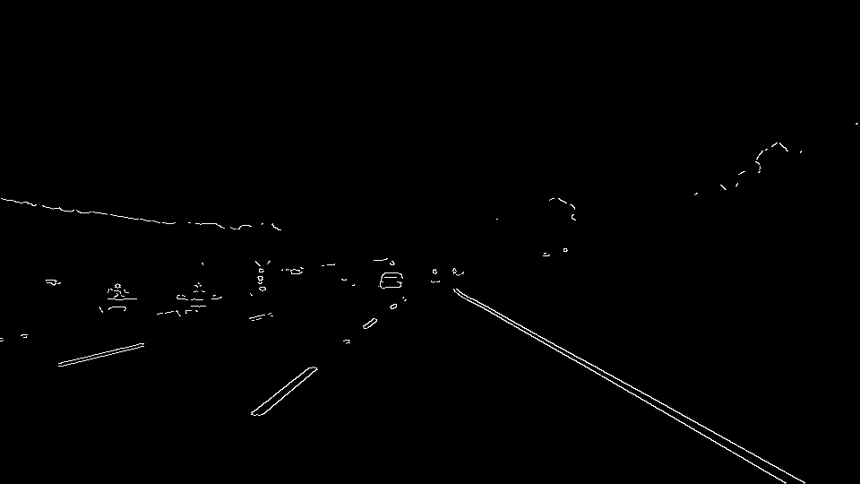
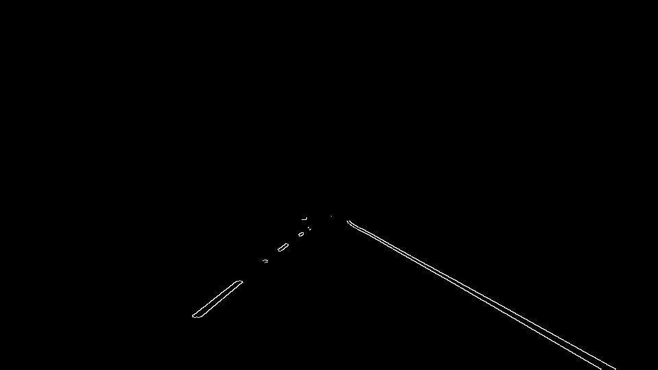
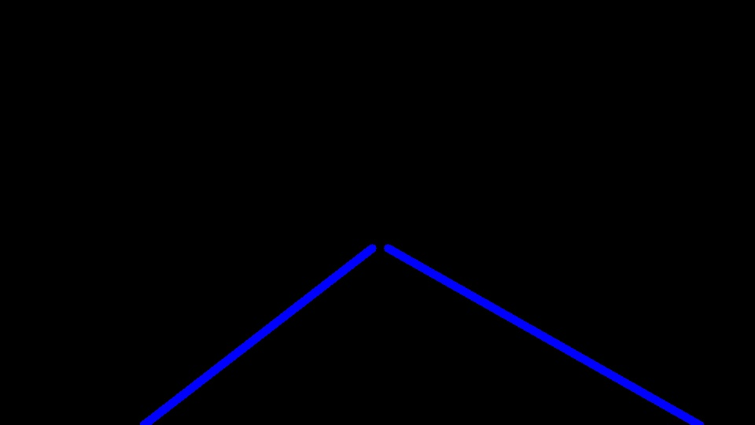
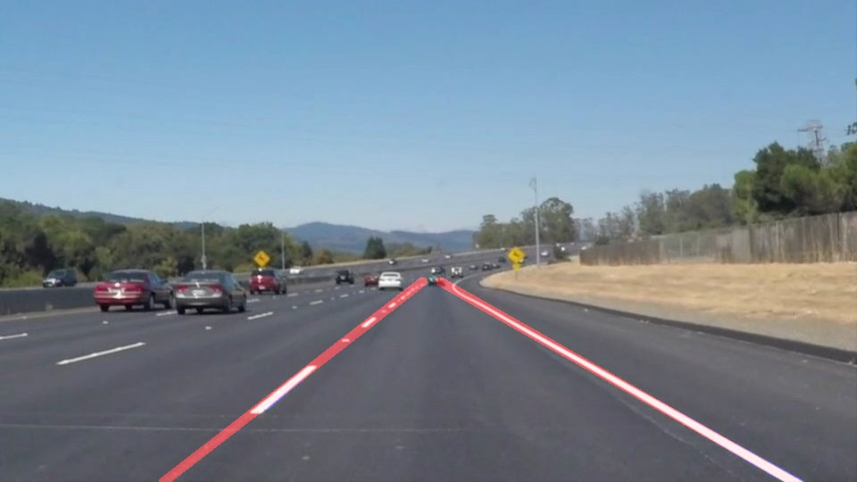

# **Finding Lane Lines on the Road** 
---

**Finding Lane Lines on the Road**

The goals / steps of this project are the following:
* Make a pipeline that finds lane lines on the road
* Reflect on your work in a written report

[//]: # (Image References)

[image1]: ./examples/grayscale.jpg "Grayscale"
[image_gray]: ./test_images_output/gray/solidWhiteCurve.jpg "image_gray"
[image_canny]: ./test_images_output/canny/solidWhiteCurve.jpg "image_canny"
[image_roi]: ./test_images_output/roi/solidWhiteCurve.jpg "image_roi"
[image_hough]: ./test_images_output/hough/solidWhiteCurve.jpg "image_hough"
[image_final]: ./test_images_output/solidWhiteCurve.jpg "image_final"

---

### Reflection

### 1. Describe your pipeline. As part of the description, explain how you modified the draw_lines() function.

My pipeline consisted of 5 steps. 
- First, I converted the images to grayscale. 
- Second, I used gaussian_blur with `kernel_size` = 3. 
- Thrid, I applied Canny's edge detection algorithm with `low_threshold = 200`, `high_threshold = 220`. 
- Then, I applied region_of_interest with a Quadrilateral. I used coordinates of ROI as (0,540), (450, 315), (550, 315), (960, 540). 
- Finally, I applied `hough_lines` with parameter of `rho = 1`, `theta=1`, `threshold=10`, `min_line_len=10`, `max_line_gap=10`

In order to draw a single line on the left and right lanes, I modified the draw_lines() function by using numpy.polyfit. 
- First, I separate lines by value of slop = (y2-y1)/(x2-x1). If the slope is positive, it should be the left side of the road. If the slope is negative it should be the right side of the road. 
- After classifing, I used `numpy.polifit` to fit with First-order equation. Under implementation of `numpy.polifit`, least square method is used. 
  - see `plot_line_polyfit` and `compute_polyfit`
- At the first, I compute the slope and bias by computing average. But by using average value, the line doen't seem to be fit with the detected line. So, I gave up by using average and use exploring function. 

Followings are the result of each step with `solidWhiteCurve.jpg`. 
- Gray Scaling

- Canny's Algorithm

- ROI

- Hough transform with straight line

- final result

### 2. Identify potential shortcomings with your current pipeline

One potential shortcoming would be what would happen when ... 

Another shortcoming could be ...

### 3. Suggest possible improvements to your pipeline

A possible improvement would be to ...

Another potential improvement could be to ...
