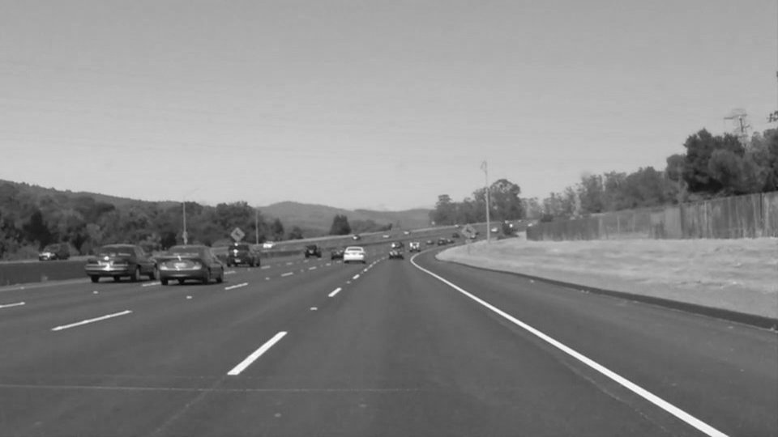

# **Finding Lane Lines on the Road** 
---

**Finding Lane Lines on the Road**

The goals / steps of this project are the following:
* Make a pipeline that finds lane lines on the road
* Reflect on your work in a written report

[//]: # (Image References)

[image1]: ./examples/grayscale.jpg "Grayscale"

---

### Reflection

### 1. Describe your pipeline. As part of the description, explain how you modified the draw_lines() function.

My pipeline consisted of 5 steps. 
- First, I converted the images to grayscale. 
- Second, I used gaussian_blur with `kernel_size` = 3. 
- Thrid, I applied Canny's edge detection algorithm with `low_threshold = 200`, `high_threshold = 220`. 
- Then, I applied region_of_interest with a Quadrilateral. I used coordinates of ROI as (0,540), (450, 315), (550, 315), (960, 540). 
- Finally, I applied `hough_lines` with parameter of `rho = 1`, `theta=1`, `threshold=10`, `min_line_len=10`, `max_line_gap=10`

In order to draw a single line on the left and right lanes, I modified the draw_lines() function by using numpy.polyfit. 
- First, I separate lines by value of slop = (y2-y1)/(x2-x1). If the slope is positive, it should be the left side of the road. If the slope is negative it should be the right side of the road. 
- After classifing, I used `numpy.polifit` to fit with First-order equation. Under implementation of `numpy.polifit`, least square method is used. 
  - see `plot_line_polyfit` and `compute_polyfit`
- At the first, I compute the slope and bias by computing average. But by using average value, the line doen't seem to be fit with the detected line. So, I gave up by using average and use exploring function. 

Followings are the result of each step with `solidWhiteCurve.jpg`. 
- Gray Scaling

- Canny's Algorithm

- ROI

- Hough transform with straight line

- final result

### 2. Identify potential shortcomings with your current pipeline
- One potential shortcoming would be the parameter for current pipeline is optimized only the `test_images`. 
  - For example, the parameter of the ROI dependes on the road on `test_images`.  If the image is diffrent road, the optimal parameter could be changed. That means if I apply this pipline to another scene, it cannot be detect lanes. 
  - Another example is different size of images. In the Optional Challenge, the size of image is different. I optimized the height with image size of `test_images`. So, the pipeline clearly cannot be applied to different size of images. 
  - Not only the roi, but also parameter of hough transform may cause the problem with different set of input images. For example, the left side lane may not be able to find in the different scene. 
- Another shotrcoming could be the shape of the lane. Hough transform can only deal with straight line. But, the road also has curve line. However, straight line cannot be fit with curve line. So the lane cannot be correctly detected if it is curved. 

### 3. Suggest possible improvements to your pipeline

A possible improvement would be to ...

- For the parameter, I have following ideas. 
  - We shuold test with much more scenes to define parameters. 
  - The parameter should be changed for the different size of images. In the program, the parameter should be changed by checking the input size of images. 
  - The parameter for hough transform should also be tested with many other images to generalize its parameters. 
- To deal with curve, fitting with polynomial function or clothoid can be the possible way to represent a curve. 

